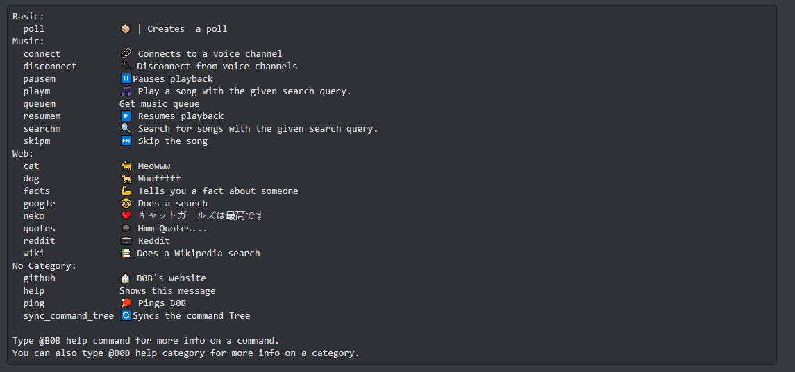

##  About

B0B is just a [Discord][discord] bot that was written for [recreational purposes][recreation]. 
B0B is written in [Python][python] using the [Discord.py][discordpy] library, as well as the [Wavelink][wavelink] library.  
B0B is connected to the [Internet][internet] and can assist in [googling][google] and searching the [Wikipedia][wikipedia] for you. 
B0B is able to send you cute pictures of [cats][cat] and [dogs][dog].

## Usage
  Make sure you have your [Lavalink server][lavalink] in the config folder.
 You will also need to configure the Example.env file. Also install all the neccesary libraries as included in requirement.txt

## Upcoming
There will (probably) be many more feature coming next, coming soon (never).

## Support
I need moral support.

  

<!------ LINKS ------>
<!--- Concepts --->
[recreation]:https://en.wikipedia.org/wiki/Recreation
[internet]:https://en.wikipedia.org/wiki/Internet
[discord]:https://discord.com/
[google]:https://www.google.com/
[wikipedia]:https://en.wikipedia.org/wiki/Wikipedia
[cat]:https://en.meming.world/images/en/b/b9/Cursed_Cat.jpg
[dog]:https://en.wikipedia.org/wiki/Man%27s_best_friend

<!--- Github ---->
[python]:https://www.python.org/
[discordpy]: https://github.com/Rapptz/discord.py
[wavelink]: https://github.com/PythonistaGuild/Wavelink
[lavalink]:https://github.com/freyacodes/Lavalink#server-configuration
